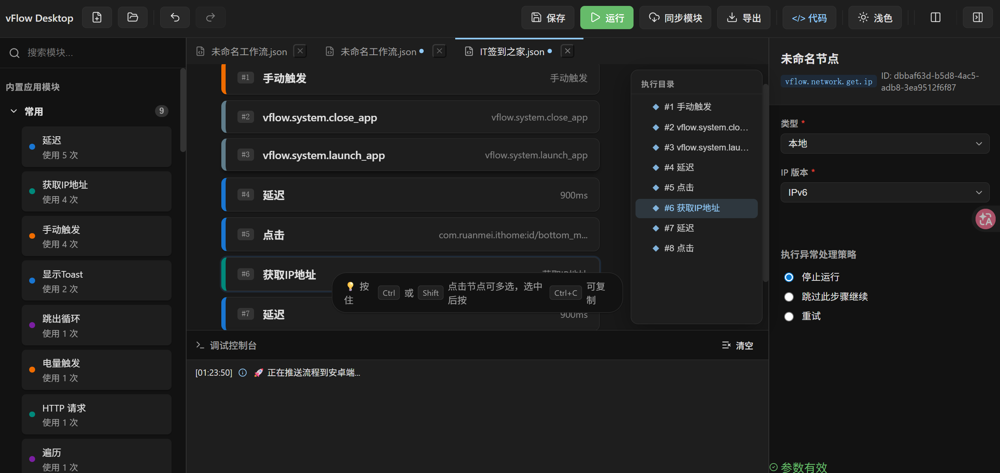
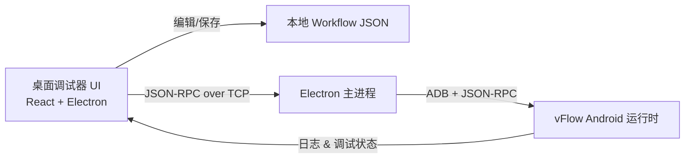

# vFlow Desktop Debugger

<p align="center">
  一个用于可视化调试 <a href="https://github.com/nichem/vflow">vFlow</a> 自动化工作流的桌面工具
</p>

<p align="center">
  
  
  
  
  
  <a href="https://zread.ai/3481882553/vflow-desktop-debugger"></a>
  <a href="https://deepwiki.com/3481882553/vflow-desktop-debugger"></a>
</p>

<p align="center">
  
</p>

> 🧠 vFlow Desktop Debugger 专注于「桌面端可视化编排 + 调试」Android 自动化工作流，适合日常脚本玩家、测试工程师与自动化开发者。

<details>
<summary>🚀 30 秒快速体验</summary>

1. 安装 Node.js ≥ 18 与 npm ≥ 9  
2. 克隆仓库并安装依赖：`git clone ... && npm install`  
3. 运行 `npm run dev` 启动完整 Electron 开发环境

</details>

---

## ✨ 功能特性

| 功能 | 说明 |
|---|---|
| 📑 多标签页 (Multi-Tab) | 类似 IDE 的页签管理，支持同时打开、切换和关闭多个 Workflow |
| 🌓 分屏对比 (Split View) | 支持双视图布局，可以在主视图编辑的同时参考副视图中的流程 |
| 🧩 图形视图 | ReactFlow 节点图展示，支持拖拽排序、多选操作、自动连线 |
| 📝 代码视图 | Monaco Editor 直接编辑原始 JSON，语法高亮 + 实时校验 + 大纲视图 |
| ⚙️ 高级属性面板 | **InputDefinition** 驱动，支持**联动可见性**、**滑动条 (Slider)** 与**文件浏览** |
| 📟 调试控制台 | 实时打印推送日志与 Android RPC 状态，支持日志分级显示 |
| ↩️ 撤销/重做 | 基于页签独立的 50 层历史栈，图形/代码双视图同步回滚 |
| 🌙 暗色模式 | 全局暗色主题适配，提供舒适的低光环境开发体验 |

## 技术栈

| 层 | 技术 |
|---|---|
| 框架 | React 18 + TypeScript 5.8 |
| 打包 | Vite 6 + SWC |
| 桌面壳 | Electron 30 |
| 图形 | ReactFlow 11 |
| 编辑器 | Monaco Editor |
| 调试 | Chrome DevTools + JSON-RPC |

## 快速开始

### 环境要求

- Node.js ≥ 18
- npm ≥ 9

### 安装与运行

```bash
# 克隆仓库
git clone https://github.com/3481882553/vflow-desktop-debugger.git
cd vflow-desktop-debugger

# 安装依赖
npm install

# 启动开发服务器（仅渲染进程，浏览器预览）
npm run dev-renderer

# 启动完整 Electron 开发环境
npm run dev

# 构建生产版本（仅编译）
npm run build

# 打包成可执行文件 (exe/dmg)
npm run dist
```

### 常用脚本

| 命令 | 作用 |
|---|---|
| `npm run dev-renderer` | 启动渲染进程开发服务器，仅浏览器预览 |
| `npm run dev` | 启动完整 Electron 环境（主进程 + 渲染进程） |
| `npm run build` | 构建生产版本 |
| `npm run dist` | 打包为安装包（如 exe / dmg） |
| `npm run typecheck` | 仅执行 TypeScript 类型检查 |

## 项目结构

```
src/
├── main/                    # Electron 主进程 (Node.js)
│   ├── main.ts              # 窗口创建 + IPC 桥接 + RPC Client
│   └── preload.ts           # 跨进程 API 暴露
└── renderer/                # React 渲染进程 (Web)
    ├── hooks/               # 业务逻辑封装
    │   ├── useWorkflow.ts   # 核心工作区状态 (Multi-Tab + Reducer)
    │   ├── useSchemas.ts    # 动态协议管理 (RPC Sync)
    │   └── useModules.ts    # 模块树加载与计数
    ├── domain/              # 协议与类型定义 (InputDefinition)
    ├── data/                # 静态镜像 Schema 与多语言
    └── ui/                  # UI 组件库
        ├── TabStrip.tsx     # 页签导航组件
        ├── WorkflowGraph.tsx # 节点画板
        ├── RightPropsPanel.tsx # 智能属性面板
        └── ConsolePanel.tsx # 调试日志控制台
```

## 使用方法

1. **新建/打开**：通过工具栏按钮直接新建空白流程或加载 `.json` 文件。
2. **多任务并行**：利用顶部标签栏在不同的工作流之间自由切换。
3. **分屏对比**：点击右上角“分屏”图标开启副视图，对比参考现有逻辑。
4. **属性编排**：点击节点后，在右侧面板配置参数。高级选项默认折叠，部分参数根据选项自动显隐。
5. **视图同步**：在图形视图与 JSON 代码视图间切换，修改将自动双向同步。
6. **调试推送**：通过 Android RPC 将流程一键推送到手机端执行。

## ⌨️ 快捷键

| 快捷键 | 操作 |
|---|---|
| `Ctrl + Z` | 撤销 |
| `Ctrl + Y` / `Ctrl + Shift + Z` | 重做 |
| `Ctrl + S` | 保存当前页签 |
| `Ctrl + T` | 新建工作流页签 |
| `Ctrl + W` | 关闭当前页签 |
| `Delete` / `Backspace` | 删除画布选中内容 |

## 🏗️ 架构设计

```
┌──────────────────────────────────────────────────┐
│                   TopToolbar                     │
├──────────────────────────────────────────────────┤
│                    TabStrip                      │
├──────────┬────────────────────────────┬──────────┤
│          │        Main Workspace      │          │
│  Left    │   ┌──────────┐┌──────────┐ │  Right   │
│  Module  │   │  Graph   ││  Split   │ │  Props   │
│  Panel   │   │   View   ││  View    │ │  Panel   │
│          │   └──────────┘└──────────┘ │          │
├──────────┴────────────────────────────┴──────────┤
│                 Console Panel                    │
└──────────────────────────────────────────────────┘
```



> 🔁 调试闭环：桌面端编辑 → 推送到设备 → 实机执行 → 回流日志与状态。


**数据流**：单向数据流，所有状态变更通过 `useWorkflow` 的 Reducer 集中管理。组件仅通过 props 接收数据和回调，不持有业务状态。

## Workflow JSON 格式

```
{
  "id": "workflow-001",
  "name": "示例工作流",
  "steps": [
    {
      "id": "step-1",
      "moduleId": "vflow.device.click",
      "parameters": { "target": "确认按钮" },
      "indentationLevel": 0
    }
  ],
  "isEnabled": true,
  "isFavorite": false,
  "wasEnabledBeforePermissionsLost": false,
  "order": 0
}
```

## 模块加载策略

模块列表按以下优先级加载：

1. **内置 JSON** — `modules_zh.json` → `modules.json`（打包在应用内）
2. **Electron Bridge** — 通过 IPC 从 vFlow Core 获取（需连接设备）
3. **Fallback** — 5 个常用模块的硬编码列表

## 🤝 贡献

> 🤝 欢迎任何形式的贡献：Bug 反馈、文档优化、功能建议或直接 Pull Request。

| 类型 | 示例贡献内容 |
|---|---|
| 🐛 Bug 修复 | 修复崩溃、边界条件、兼容性问题 |
| ✨ 新特性 | 新增节点类型、调试能力或 UI 交互优化 |
| 📚 文档 | 完善 README、添加使用教程或 FAQ |
| 🧪 测试 | 为关键逻辑补充单元测试 / 集成测试 |

<details>
<summary>🛠️ 提交流程示例</summary>

```bash
# Fork 后克隆
git clone https://github.com/3481882553/vflow-desktop-debugger.git

# 创建功能分支
git checkout -b feature/your-feature

# 提交并推送
git commit -m "feat: 添加新功能"
git push origin feature/your-feature
```

</details>

- 在提交 PR 前，建议本地至少执行一次：
  - `npm run typecheck`
  - `npm run build`
- 提交信息尽量使用语义化前缀：`feat: `、`fix: `、`docs: ` 等
- 如涉及重大行为变更，请在描述中说明变更背景与迁移方式

## 相关项目

### Android 端 vFlow
本桌面调试器对应的 Android 端项目是 [vFlow](https://github.com/ChaoMixian/vFlow)，这是一个用于 Android 设备的自动化工作流执行引擎。

- **GitHub 仓库**: [ChaoMixian/vFlow](https://github.com/ChaoMixian/vFlow)
- **功能**: 在 Android 设备上执行和管理可视化工作流
- **集成状态**: 桌面调试器已实现 ADB 和 JSON-RPC 通信框架，但 Android 端的 DebugServer 尚未完成，目前推送功能处于开发阶段

桌面调试器主要用于开发和调试工作流，而 Android 端 vFlow 将负责在移动设备上实际执行这些工作流。

## 📮 交流与反馈

> 💡 如果你在使用过程中遇到问题，或有新的想法，可以提交isue或打开deepwiki和zread查看本项目的详细介绍

- GitHub Issues：<https://github.com/3481882553/vflow-desktop-debugger/issues>
- DeepWiki AI 文档：<https://deepwiki.com/3481882553/vflow-desktop-debugger>
- Ask Zread 问答：<https://zread.ai/3481882553/vflow-desktop-debugger>

也欢迎 Star ⭐ 支持本项目，让更多开发者发现它。

## License

[MIT](LICENSE)
